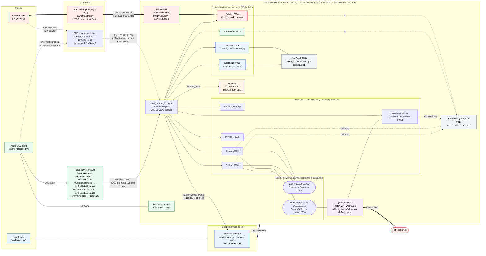

# nthncrtr

Version-controlled config and operational runbooks for the home network at `nthncrtr.com` — a small set of services running on one Beelink mini PC (`natto`), a Pi appliance for coffee roasting (`starmaya`), and a Mac client (`workhorse`).

Two ideas shape almost every decision in this repo:

1. **One service is exposed to the public internet (Jellyfin); everything else lives on the tailnet.** External names like `nextcloud.nthncrtr.com` resolve to natto's Tailscale IP (`100.x`), which the public internet can't route to — so the names are public, but reaching them requires Tailscale membership. The single exception, Jellyfin, has its own dedicated path via a Cloudflare Tunnel.
2. **An admin tier sits behind SSO (Authelia); the rest don't.** Sonarr, Radarr, Prowlarr, qBittorrent, and Homepage are gated by a Caddy `forward_auth` to Authelia. Jellyfin, Immich, Nextcloud, and Navidrome aren't — their native mobile clients can't navigate the auth-redirect flow.

## Architecture



**How to read this diagram.** Solid bold edges trace the public Jellyfin path (Cloudflare-proxied → outbound Cloudflare Tunnel → Jellyfin). Dotted edges show the tailnet-only path used by every other `*.nthncrtr.com` — grey-cloud A records point to natto's `100.x` Tailscale IP, which is unroutable from the public internet, so only tailnet members reach Caddy. Plain solid edges are inside-LAN traffic; note the two split-horizon names (`music`, `play`) where Pi-hole overrides to natto's LAN IP `192.168.1.50` for LAN-direct delivery. The `gluetun` sidecar gives qBittorrent its own VPN egress that bypasses natto's default route.

For a concept-by-concept walkthrough of *why* the architecture looks like this — DNS, NAT/CGNAT, reverse proxies, tunnels, split-horizon, forward-auth, etc. — see [`docs/networking-primer.md`](docs/networking-primer.md).

## Hosts

| Host | Hostname | Role | Hardware / OS |
|---|---|---|---|
| **natto** | `natto` | Hub: reverse proxy, DNS, all docker services | Beelink Mini S12 · x86_64 · Ubuntu Server 26.04 LTS (migrated from a Pi/arm64/Debian on 2026-05-16) |
| **starmaya** | `kvass` (machine name) | Workshop appliance: coffee roaster profiler | Raspberry Pi · arm64 · Debian 13. On the tailnet as `kvass.tailaf7ea6.ts.net`. |
| **workhorse** | `workhorse` | Client + dev workstation | Intel Mac. Hosts no services; this is where most ops work originates. |

`starmaya` is the canonical service name and intended future hostname; the actual machine is currently `kvass`. The repo always says `starmaya`.

## Services

Grouped by exposure tier — this is the dimension that matters most when reasoning about what can reach what.

**Public (internet-facing):** Jellyfin only, via the Cloudflare Tunnel (`services/cloudflared`). The tunnel's ingress map is deliberately scoped to `play.nthncrtr.com → Jellyfin` and nothing else. A Cloudflare WAF rate-limit on the login path handles brute-force.

**Tailnet-only, admin tier (behind Authelia SSO):** Sonarr, Radarr, Prowlarr, qBittorrent, Homepage. Caddy `forward_auth`s each request to Authelia; their compose ports bind to `127.0.0.1` so the only path is through Caddy + Authelia.

**Tailnet-only, native-client tier (no Authelia):** Jellyfin (also public, see above), Immich (photos), Nextcloud (files), Navidrome (music). Their native mobile clients can't navigate `forward_auth` redirects, so they use their own per-app auth instead.

**Local-only:** Pi-hole serves DNS for the whole household; not exposed by name.

**Workshop:** `roaster-daemon` + `roaster-web` on `starmaya`, fronted by Caddy as `starmaya.nthncrtr.com`.

## Repo layout

```
.
├── CLAUDE.md                    deep context for AI-assisted edits (most authoritative single doc)
├── README.md                    this file
├── WORKLIST.md                  mission tracker — current, planned, done
├── deploy.sh                    repo → /srv/<svc>/ on natto, with safety gates
├── bootstrap/                   one-shot host setup scripts (idempotent, run as root)
├── docs/
│   └── networking-primer.md     concept walkthrough using this homelab as the worked example
├── runbooks/                    operational procedures
│   ├── migrate-natto.md         cold-rebuild natto from scratch
│   ├── migrate-off-gdrive.md    one-time Drive → Nextcloud move
│   ├── media-layout.md          /mnt/media organization
│   └── proton-vpn-setup.md      gluetun / Proton VPN setup notes
└── services/                    one directory per service
    ├── caddy/                   reverse proxy (native systemd)
    ├── pihole/                  household DNS
    ├── cloudflared/             the public path for Jellyfin
    ├── authelia/                SSO IdP for the admin tier
    ├── jellyfin/                video (only internet-exposed service)
    ├── immich/                  photos / videos (Google Photos replacement)
    ├── nextcloud/               files (tailnet-only)
    ├── navidrome/               music
    ├── homepage/                dashboard
    ├── qbittorrent/             torrents + gluetun (Proton VPN) sidecar
    ├── sonarr/ radarr/ prowlarr/  the *arrs
    ├── starmaya/                systemd units for the coffee roaster (deploys to kvass)
    └── backup/                  backup.sh + nextcloud-data-sync.sh + their timers
```

## Usage

Most config changes go through `deploy.sh` from a checkout on natto itself:

```sh
ssh -t natto
cd /srv/nthncrtr-repo
git pull
sudo ./deploy.sh                          # default services
sudo ./deploy.sh --dry-run                # preview
sudo ./deploy.sh navidrome homepage       # specific services
sudo ./deploy.sh --yes-pihole pihole      # pihole requires the DNS-outage gate
sudo ./deploy.sh starmaya                 # opt-in; deploys to kvass via ssh
```

`deploy.sh` enforces the safety gates: Caddy gets `caddy adapt` validation before any file lands in `/etc/caddy/`, Pi-hole requires `--yes-pihole`, and starmaya is opt-in.

To bring up a replacement natto from cold metal, follow [`runbooks/migrate-natto.md`](runbooks/migrate-natto.md). Per-service ops notes (ports, secrets, container names, data paths) live in each `services/<svc>/README.md`.

## Conventions

- **Service data lives at `/srv/<svc>/` on natto**, compose file co-located with `./data` and `./config` so relative paths resolve.
- **Secrets are never committed.** Each service ships `secrets.env.example` with empty variables; the real `secrets.env` (mode `0600`) lives at `/srv/<svc>/` and is `.gitignore`d. Caddy's `CF_API_TOKEN` lives at `/etc/caddy/caddy.env`, owned `caddy:caddy`, loaded via systemd `EnvironmentFile=`.
- **5TB drive at `/mnt/media`** (ext4; mount root `root:root`, service subdirs `chown`ed to `nthncrtr`). Music at `/mnt/media/music`, video at `/mnt/media/video/{movies,tv}`, backups at `/mnt/media/backups`. `/mnt/media` is read-mostly — never run destructive operations against it. Layout + storage model: [`runbooks/media-layout.md`](runbooks/media-layout.md).
- **Pi-hole stops require explicit confirmation.** A restart drops DNS for everyone in the house for ~30s. Caddy reloads require a successful `caddy adapt` (preferred over `caddy validate`, which tries to provision TLS) before touching the running config.
- **Cloudflare DNS records are not in the repo.** Each `*.nthncrtr.com` subdomain is a per-name grey-cloud A record pointing at natto's Tailscale IP `100.122.71.33` — added by hand in the Cloudflare dashboard. A brand-new subdomain needs that record before Caddy can serve it.

## Where to look for what

- **What was decided and when** → [`WORKLIST.md`](WORKLIST.md). Each mission has Preconditions / Success criteria / Rollback / Outcome.
- **Networking concepts behind the architecture** → [`docs/networking-primer.md`](docs/networking-primer.md).
- **Cold-rebuild procedure** → [`runbooks/migrate-natto.md`](runbooks/migrate-natto.md).
- **Per-service ops** → `services/<svc>/README.md`.
- **Full collaboration context (for humans and AI)** → [`CLAUDE.md`](CLAUDE.md). The most authoritative single document in the repo.
